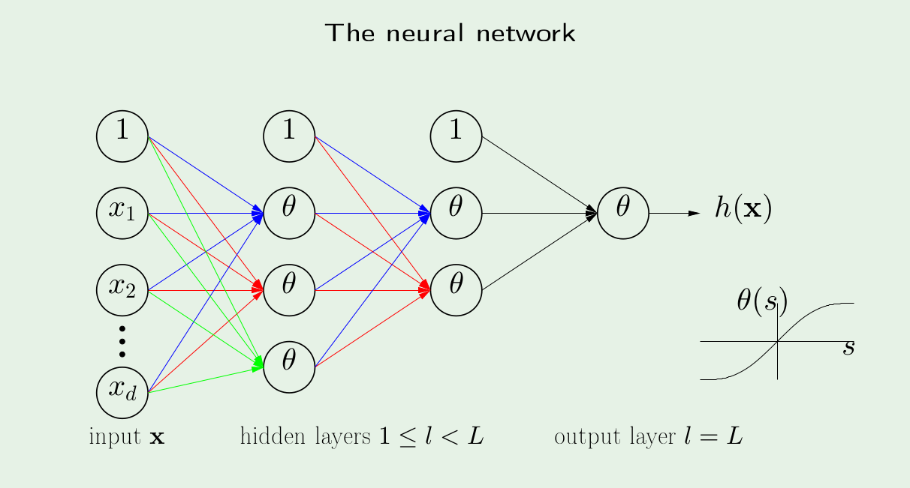

 ## ARTIFICIAL NEURAL NETWORK
 #### MULTI LAYER PERCEPTRON
* Implementation of multi layer percptron in C language
* (Linux User) compile the code   
	`gcc multiLayerPerceptron.c -o multiLayerPerceptron -lm`
* Execute  
	`./multiLayerPerceptron`
* The training data used is iris data set out of which  
80% is used as training and 20% is used for testing
* You can easlily modify the training and testing data just by giving the  
filename(with path if not in same directory) with path in the source code.

* Paramaters of this MLP can be easily regulated
    - Number of hidden layers can be changed
    - Number of input layers can be changed but it should be  
    according to the training data
    - Number of labels can be changed but is should be also  
    according to the training data
    - Number of nodes in hidden layer can also be modified  

*Note :- Instruction to modify the parameters are commented in the source code*  
* To know about neural network a pdf file attached in this repository  
Ref- **Yaser S. Abu-Mostafa** (*California Institute of Technology*)  

If u find any bug or anything optimization in this code please report it to  
Email:- princebantikumar@gmail.com  
[ LinkedIn  ](www.linkedin.com/in/princebantikumar)   

